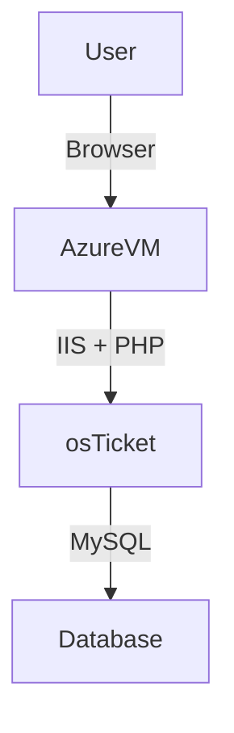

<h1>osTicket - Prerequisites and Installation</h1>
This tutorial outlines the prerequisites and installation of the open-source help desk ticketing system osTicket. 

# 🛠️ osTicket on Azure VM (Windows 10): Prerequisites and Installation

---

## 📌 Project Overview
This project documents the step-by-step installation of **osTicket v1.15.8** on an **Azure Virtual Machine running Windows 10**. It covers VM setup, IIS + PHP + MySQL configuration, osTicket deployment, and final security cleanup. I will completing this project using a MacbookAir(MacOS)

---

## 📑 Table of Contents
1. [Provision Azure Virtual Machine](#1-provision-azure-virtual-machine)
2. [Prepare Installation Files](#2-prepare-installation-files)
3. [Configure IIS and PHP](#3-configure-iis-and-php)
4. [Install and Configure MySQL](#4-install-and-configure-mysql)
5. [Configure IIS with PHP](#5-configure-iis-with-php)
6. [Deploy osTicket](#6-deploy-osticket)
7. [Enable PHP Extensions](#7-enable-php-extensions)
8. [Configure osTicket Files](#8-configure-osticket-files)
9. [Set Up osTicket Database](#9-set-up-osticket-database)
10. [Complete Web Installation](#10-complete-web-installation)
11. [Post-Installation Cleanup](#11-post-installation-cleanup)
12. [Architecture Diagram](#-architecture-diagram-optional)
13. [Next Steps](#-next-steps)

---

## 🚀 Installation Steps

### 1. Create an Azure Virtual Machine **I'll be using these VM Specifications for this project:**
- **Resource Group:** [Create new, any name you like that works]
- **Virtual Machine Name:** [Any name you like that works]
- **Image(OS):** Windows 10 Pro, version 22H2 
- **Size(vCPUs):** Standard_D2s_v3 - 2 vcpus, 8 GiB memory
- **Administrator Account:** Create new, *These credetials will be used to Log into the VM via           Remote Desktop for (WindowsOs)or Download Windows App for (MacOs)

---

### 2. Prepare Installation Files
- Once VM deployment is complete, add a PC in the Windows App(Remote Desktop) using the IP address      of the VM in Azure, then log into the VM using the adminsistrator account credentials 
- I have provided a link here:(https://docs.google.com/document/d/1DyjX8LeVU98LjhXO2t2K2F0aHywI2N9GD57T3taO5qo/edit?tab=t.0) This link will provide with everything you need to get osTicket up and operating.
- Download **osTicket-Installation-Files.zip**, Unzip to Desktop → Folder should be named **osTicket-Installation-Files** (all dependencies and installers will come from this folder)

---

### 3. Configure IIS and PHP
   -**Install IIS with CGI support:**
   -  Go to Contorl Panel → Uninstall a program → Select Turn windows features on or off (on the left       side) → Enable Internet Information Services **(IIS)** → World Wide Web Services → Application Development      Features → Enable **CGI**.

   -  From **osTicket-Installation-Files** → Install **PHPManagerForIIS_V1.5.0** & **rewrite_amd64_en-US** (*Install individually by double-clicking each one seperately)

   - **Create a directory:** Go to File Exploer → This PC → Windows(C:) → create new folder(Titled "PHP")
  
   -  Go back to **osTicket-Installation-Files** → (right-click) php-7.3.8-nts-Win32-VC15-x86.zip → Extract All → Browse → C:\PHP → Extract
   

   - Also in **osTicket-Installation-Files** → install VC_redist.x86.exe (double-click)

### 4. Install and Configure MySQL
   
   
   From **osTicket-Installation-Files** → install mysql-5.5.62-win32.msi (double-click) → 
   (throughout install) select Typical Setup → Run Configuration Wizard → Standard    
Configuration 
---

### 5. Configure IIS with PHP
1. Open IIS **as Administrator**.
2. Register PHP with PHP Manager → point to: `C:\PHP\php-cgi.exe`
3. Restart IIS (Stop + Start the server).

---

### 6. Deploy osTicket
1. From the installation folder, unzip **osTicket v1.15.8**.
2. Copy the **upload** folder into `C:\inetpub\wwwroot`.
3. Rename `upload` → `osTicket`.
4. Restart IIS.
5. In IIS Manager → Sites → Default → osTicket → click **Browse *:80**.

---

### 7. Enable PHP Extensions
- In IIS → Sites → Default → osTicket → PHP Manager → Enable/Disable Extensions.
- Enable:
  - `php_imap.dll`
  - `php_intl.dll`
  - `php_opcache.dll`
- Refresh osTicket in the browser to confirm changes.

---

### 8. Configure osTicket Files
1. Rename configuration file:
   - From: `C:\inetpub\wwwroot\osTicket\include\ost-sampleconfig.php`
   - To: `C:\inetpub\wwwroot\osTicket\include\ost-config.php`
2. Assign permissions:
   - Disable inheritance → Remove All
   - Add new permission: **Everyone → Full Control**

---

### 9. Set Up osTicket Database
1. Install **HeidiSQL** from installation folder.
2. Open HeidiSQL → create a new session 
3. Connect and create a new database: **osTicket**.

---

### 10. Complete Web Installation
1. In the osTicket browser setup:
   - Helpdesk Name: *Your Choice*
   - Default Email: (receives customer tickets)
   - MySQL Database: **osTicket**
   - Username: **root**
   - Password: **root**
2. Click **Install Now!**
3. Access URLs:
   - Admin/Staff Login: [http://localhost/osTicket/scp/login.php](http://localhost/osTicket/scp/login.php)
   - End User Portal: [http://localhost/osTicket/](http://localhost/osTicket/)

---

### 11. Post-Installation Cleanup
- Delete setup directory: `C:\inetpub\wwwroot\osTicket\setup`
- Set config file to read-only:
  - `C:\inetpub\wwwroot\osTicket\include\ost-config.php`

✅ osTicket is now fully installed and secured on your Azure VM!

---

## 📊 Architecture Diagram (Optional)

---

## 📖 Next Steps
- Add SSL/TLS for secure access.
- Configure email piping/SMTP for ticket creation.
- Regularly back up MySQL and VM snapshots.

---

📌 **Author:** Your Name  
📌 **License:** MIT
