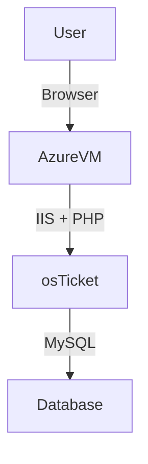

<h1>osTicket - Prerequisites and Installation</h1>
This tutorial outlines the prerequisites and installation of the open-source help desk ticketing system osTicket. 

<h2>Environments and Technologies Used</h2>

- Microsoft Azure (Virtual Machines/Compute)
- Microsoft Remote Desktop (RDP)
- Internet Information Services (IIS)

<h2>Operating Systems Used </h2>

- Windows 10</b> (21H2)

<h2>List of Prerequisites</h2>

- Azure Virtual Machine
- osTicket Installation Files
- Heidi SQL
---

##  Installation Steps

### Create an Azure Virtual Machine 

- **Resource Group:** [Create new, any name you like that works]
- **Virtual Machine Name:** [Any name you like that works]
- **Image(OS):** Windows 10 Pro, version 22H2 
- **Size(vCPUs):** Standard_D2s_v3 - 2 vcpus, 8 GiB memory
- **Administrator Account:** Create new, *These credetials will be used to Log into the VM via Remote Desktop for (WindowsOs)or Download Windows App for (MacOs)

---

### Prepare Installation Files

- Once VM deployment is complete, add a PC in the Windows App(Remote Desktop) using the IP address      of the VM in Azure, then log into the VM using the adminsistrator account credentials

 

- I have provided a link here:(https://docs.google.com/document/d/1DyjX8LeVU98LjhXO2t2K2F0aHywI2N9GD57T3taO5qo/edit?tab=t.0) This link will provide with everything you need to get osTicket up and operating.
- Download **osTicket-Installation-Files.zip**, Unzip to Desktop → Folder should be named **osTicket-Installation-Files** (all dependencies and installers will come from this folder)

---

### Install IIS with CGI support

   -  Go to Contorl Panel → Uninstall a program → Select Turn windows features on or off (on the left       side) → Enable Internet Information Services **(IIS)** → World Wide Web Services → Application Development Features → Enable **CGI**.

  
   -  From **osTicket-Installation-Files** → Install **PHPManagerForIIS_V1.5.0** & **rewrite_amd64_en-US** (*Install individually by double-clicking each one seperately)

  
   - **Create a directory:** Go to File Exploer → This PC → Windows(C:) → create new folder(Titled "PHP")
  
  
   -  Go back to **osTicket-Installation-Files** → (right-click) php-7.3.8-nts-Win32-VC15-x86.zip → Extract All → Browse → Windows (C:) → PHP → Extract
   

  
   - Also in **osTicket-Installation-Files** → install VC_redist.x86.exe (double-click)

---

### Install and Configure MySQL

   From **osTicket-Installation-Files** → install mysql-5.5.62-win32.msi (double-click) → 
   (throughout install) select Typical Setup → Run Configuration Wizard → Standard    
Configuration → Modify Security Settings, New root password & Confirm: root → Execute

username: root

password: root

(simplie credentials for the sake of this project)   

---

### 5. Configure IIS with PHP (Register PHP with PHP Manager)

-  Start (Menu) → type IIS(Internet Information Services) → Run as Administrator → PHP Manager → Register new PHP version → Browse → Windows (C:) → PHP → php-cgi → open

-  Restart IIS by right-clicking server(osTicket-vm-name) → Stop (wait a moment) → Start

### 6. Deploy osTicket

-  From **osTicket-Installation-Files** → (right-click) osTicket v1.15.8 → Extrat All, with in the same folder which creates a separate folder osTicket v1.15.8 (at the top)

Click into the newly created file folder **osTicket v1.15.8**(not the zip folder) → Copy the upload folder → Windows(C:) → inetpub → wwwroot → paste

Rename "upload" to "osTicket"(exactly how its spelled) → restart IIS agagin by right-clicking server(osTicket-vm-name) → Stop (wait a moment) → Start

In IIS Manager → server(osTicket-vm-name) → Sites → Default Web Site → osTicket → Browse *:80(http)

That should bring up osTicket

---

### 7. Enable PHP Extensions that are Disabled (in previous picture)

- In IIS → Sites → Default → osTicket → PHP Manager (double-click) → Enable or Disable an Extension
- Find and Enable:
  - php_imap.dll 
  - php_intl.dll
  - php_opcache.dll
- Refresh osTicket in the browser to confirm changes.

Notice a few more PHP Extensions are now checked green
 

### 8. Configure osTicket Files

-  Rename configuration file and assign permissions
 
 -  File Exploer → This PC  → windows(C:) → inetpub → wwwroot → osTicket → include → find **ost-sampleconfig.php** (right-click) → Rename → **ost-config.php** 

-  **ost-config.php**(right-click) → properties → Security → Advanced → Diable inheritance → Remove all inherited permissions from this object → Add → Select a principal → 'type' Everyone (for the sake of the project) → Check Names → OK → check Full control → Apply → OK

---

### 9. Set Up osTicket Database

Go to **osTicket-Installation-Files** on the Desktop → HeidiSQL_12.3.0.6589_Setup → Install → skip → New →
Username: **root** & Password: **root** → Open → Unnamed(right-click) → Create New → Database → 
Name: osTicket → OK

---

### 10. Complete Web Installation

Go back to osTicket website in web browser → Press Continue → Fill out osTicket Basic Installation - System Settings and Admin User areas with your own information 

For Database Settings put these specifics(for the sake of the lab) →

MySQL Database: **osTicket**
MySQL Username: **root**
MySQL Password: **root**

 Click **Install Now!**

 ***osTicket is Officially UP and Ready to Operate***

 ---

 
 Access URLs:
   
   
   - Admin/Staff Login: [http://localhost/osTicket/scp/login.php](http://localhost/osTicket/scp/login.php)
   
   
   

   
   
   
  
   
   - End User Portal: [http://localhost/osTicket/](http://localhost/osTicket/)

  
   

---

✅ **osTicket is now fully installed and secured on your Azure VM!**

---

##  Architecture Diagram 

---

 **Author:** Ed Latimer
