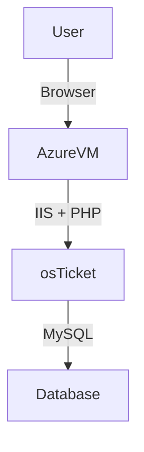

<h1>osTicket - Prerequisites and Installation</h1>
This tutorial outlines the prerequisites and installation of the open-source help desk ticketing system osTicket. 

<h2>Environments and Technologies Used</h2>

- Microsoft Azure (Virtual Machines/Compute)
- Microsoft Remote Desktop (RDP)
- Internet Information Services (IIS)

<h2>Operating Systems Used </h2>

- Windows 10</b> (21H2)

<h2>List of Prerequisites</h2>

- Azure Virtual Machine
- osTicket Installation Files
- Heidi SQL

<h2>Installation Steps<h2>

 ### Create an Azure Virtual Machine 
 - Within Azure, go search up Virtual Machines → Create → Virtual Machine

---

- Now, in order for Azure to create/validate the virtual machine, you must enter desired credentials and ONLY have to modify the settings mentioned below (all other settings can be left alone/default)

- **Resource Group:** [Create new, any name you like that works]
- **Virtual Machine Name:** [Any name you like that works]
- **Image(OS):** Windows 10 Pro, version 22H2 
- **Size(vCPUs):** Standard_D2s_v3 - 2 vcpus, 8 GiB memory
- **Administrator Account:** Create new, *These credetials will be used to Log into the VM via Remote       Desktop App (MacOs)
    

- Once this is complete, you can click on "Review+Create"

---

- Azure will then run a Validation process. If previous steps are completed correctly, you will be brought to this screen stating "Validation passed"

 - You may now click "Create" and deployment process of your virtual machine will now take place

 - Once process finishes, screen will tell you "Your deployment is complete"

---

### Loging into Virtual Machine and Preparing Installation Files

Once VM deployment is complete, we are going to open the Remote Desktop app and add a PC 

It is going to require a host name/PC name, which you will use the Public IP Address of the virtual machine you just created within Azure

- You can also give the virtual machine a name to properly identify it (for this project we'll use "osTicket"). Once thats entered, it should look something like this 

- Select "ADD" and you now have a created virtual machine that is ready to operate

Next, we are going to select the virtual machine within the Remote Desktop app and login using the same Administrator Account credentials that you used to create the Virtual machine within Azure (in the previous beginning steps)

- The actual virtual machine will then open and begin loading

 
 - After loading, you have successfully logged into the virtual machine you created!

**Note: Everything from here on out will be done the the Virtual Machine only.**

---

- Copy this link (osTicket Installation Files): (https://drive.usercontent.google.com/download?id=1b3RBkXTLNGXbibeMuAynkfzdBC1NnqaD&export=download&authuser=0)    (all dependencies and installers will come from this folder)
- Within the virtual machine open up Microsoft Edge web browser and paste the (osTicket Installation Files) link above in the browser's search bar and enter

 

- It'll bring you to this page, select "Download anyway"  

- Once download completes open **osTicket-Installation-Files.zip**, it will take you to the downloads folder, from there click and drag it to Desktop → then (right click) Extraxt All → (should be named **osTicket-Installation-Files**) select "Extract"

- The File folder "osTicket-Installation-Files" should pop up

 - As you you can see it is containing all of the file dependencies and installers inside of the folder

 - **Optional:** Feel free to delete the original **osTicket-Installation-Files.zip** (icon with actual zipper on it), since we unziped the file and now have everything we need in the new **osTick-Installation-Files** folder
 

 ---
 
 
### Install IIS with CGI support

 - Go to Start Menu → Contorl Panel → Uninstall a program → Select Turn windows features on or off (on the left side) → Enable Internet Information Services **(IIS)** → World Wide Web Services → Application Development Features → Enable **CGI** → OK

   

 - Allow a moment for install to finish and it will let you know it is complete

  

---
 
 
 
 
 ### Installing PHP Manager & Rewrite Module
  
 - From **osTicket-Installation-Files** → Install **PHPManagerForIIS_V1.5.0** & **rewrite_amd64_en-US** (* Double-click individually and go through each installation seperately)

- PHP Manager Install

- Rewrite Module Install

 ---
 
 ### Create a directory on C:\PHP & Install Visual C++ Redistributable

- Go to File Exploer → This PC → Windows(C:) → create new folder(Titled "PHP")
  

- Go back to **osTicket-Installation-Files** → (right-click) **php-7.3.8-nts-Win32-VC15-x86.zip** → Extract All → Browse → Windows (C:) → PHP → Extract
   

- As you can see all Extracted files are now in the PHP folder you just created

  
   
   
- Next, go back in **osTicket-Installation-Files** → (Double-click) **VC_redist.x86.exe** and go through install

---

### Install and Configure MySQL

- Go to **osTicket-Installation-Files** → (double-click) **mysql-5.5.62-win32.msi** → (throughout install) select Typical Setup → Run Configuration Wizard → Standard Configuration → Modify Security Settings, New root password: root & Confirm: root → Execute → Finish

**username: root**
**&** **password: root**
(simplie credentials for the sake of this project)   

---

### Configure IIS with PHP (Register PHP with PHP Manager)

- Start (Menu) → Type IIS(Internet Information Services) → Run as Administrator → PHP Manager → Register new PHP version → Browse → Windows (C:) → PHP → php-cgi → Open → Ok
  

- Now restart IIS within IIS Manager by right-clicking server **osTicket-vm** → Stop (wait a moment) → Start

### Deploy osTicket

- Go back **osTicket-Installation-Files** → (right-click) osTicket v1.15.8 → Extrat All, with in the same folder which creates a separate folder osTicket v1.15.8 (at the top)

Click into the newly created file folder **osTicket v1.15.8**(not the zip folder) → Copy the upload folder → Windows(C:) → inetpub → wwwroot → paste

Rename "upload" to "osTicket"(exactly how its spelled) → restart IIS agagin by right-clicking server(osTicket-vm-name) → Stop (wait a moment) → Start

In IIS Manager → server(osTicket-vm-name) → Sites → Default Web Site → osTicket → Browse *:80(http)

That should bring up osTicket

---

### 7. Enable PHP Extensions that are Disabled (in previous picture)

- In IIS → Sites → Default → osTicket → PHP Manager (double-click) → Enable or Disable an Extension
- Find and Enable:
  - php_imap.dll 
  - php_intl.dll
  - php_opcache.dll
- Refresh osTicket in the browser to confirm changes.

Notice a few more PHP Extensions are now checked green
 

### 8. Configure osTicket Files

-  Rename configuration file and assign permissions
 
 -  File Exploer → This PC  → windows(C:) → inetpub → wwwroot → osTicket → include → find **ost-sampleconfig.php** (right-click) → Rename → **ost-config.php** 

-  **ost-config.php**(right-click) → properties → Security → Advanced → Diable inheritance → Remove all inherited permissions from this object → Add → Select a principal → 'type' Everyone (for the sake of the project) → Check Names → OK → check Full control → Apply → OK

---

### 9. Set Up osTicket Database

Go to **osTicket-Installation-Files** on the Desktop → HeidiSQL_12.3.0.6589_Setup → Install → skip → New →
Username: **root** & Password: **root** → Open → Unnamed(right-click) → Create New → Database → 
Name: osTicket → OK

---

### 10. Complete Web Installation

Go back to osTicket website in web browser → Press Continue → Fill out osTicket Basic Installation - System Settings and Admin User areas with your own information 

For Database Settings put these specifics(for the sake of the lab) →

MySQL Database: **osTicket**
MySQL Username: **root**
MySQL Password: **root**

 Click **Install Now!**

 ***osTicket is Officially UP and Ready to Operate***

 ---

 
 Access URLs:
   
   
   - Admin/Staff Login: [http://localhost/osTicket/scp/login.php](http://localhost/osTicket/scp/login.php)
   
   
   

   
   
   
  
   
   - End User Portal: [http://localhost/osTicket/](http://localhost/osTicket/)

  
   

---

✅ **osTicket is now fully installed and secured on your Azure VM!**

---

##  Architecture Diagram 

---

 **Author:** Ed Latimer
